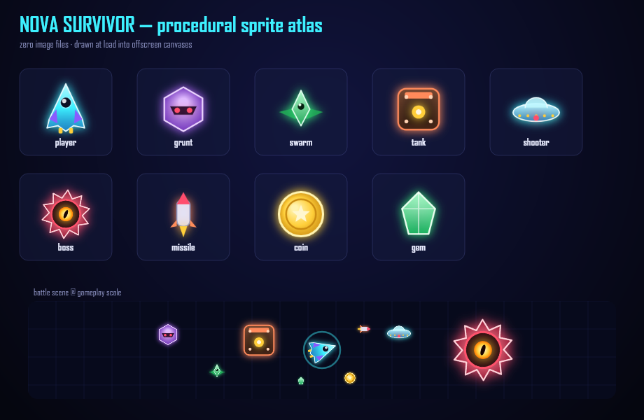

# ⭐ NOVA SURVIVOR — Idle Galaxy Defender

A hyper-addictive, **from-scratch** HTML5 auto-survivor (the Vampire Survivors / Survivor.io formula)
with roguelite level-ups, meta progression, and a **full pay-to-win economy**.

- **Zero asset loading** — every sprite is **drawn procedurally** into an offscreen canvas at startup
  (see [sprites.js](sprites.js)), so the whole game ships with **no image files** and runs **fully
  offline**. Perfect for wrapping into an Android APK.



- **Touch-first** — floating joystick + auto-firing weapons (also playable with WASD/mouse).
- **Built-in monetization hooks** — premium gems, gacha crate, IAP tiers, revives, and stacking
  permanent boosts. The IAP "purchase" is simulated; a one-line hook shows where real billing goes.

```
platform/
├── index.html            # shell + all UI screens + boot splash
├── style.css             # premium glassmorphic theme + micro-interactions
├── icons.js              # custom inline-SVG icon set (replaces all emoji)
├── sprites.js            # procedural sprite atlas (no image files)
├── space.js              # living parallax starfield + nebula background
├── game.js               # the entire engine + game + economy
├── manifest.json         # PWA manifest
├── assets/               # app icon, splash, favicon (icon.png, splash.png …)
├── package.json          # dev server + capacitor scripts
├── capacitor.config.json # Android wrapper config
├── *-preview.png         # rendered art references
└── README.md
```

---

## ▶ Run it (web)

It's just static files — any static server works.

```powershell
# from this folder
npm start          # serves on http://localhost:8080  (uses npx serve)
```

Or open `index.html` directly in a browser. (A server is recommended so `localStorage` saves persist
under a stable origin, and so audio unlocks cleanly.)

**Controls**
- **Mobile:** touch & hold anywhere to spawn a joystick; drag to move. Guns fire automatically.
- **Desktop:** WASD / arrow keys to move, `Esc` to pause.

---

## 🎮 The addiction loop (why it works)

1. **Easy to start, impossible to stop** — one input (move), instant action, numbers fly everywhere.
2. **Level-up every few seconds** — pick 1 of 3 roguelite cards (new weapons / stat boosts).
3. **Weapon EVOLUTIONS** — max a weapon **and** own its catalyst stat → a special EVOLVE card
   transforms it into a far stronger form (the genre's signature "aha" moment).
4. **Death is progress** — every run banks 🪙 coins → permanent **Upgrades** (meta shop).
5. **The wall** — difficulty ramps; a **boss** every 60s. You *can* push further with money.
6. **Pay-to-win** — 💎 gems buy: ×2 coins forever, +50% damage stacks, auto-revive, VIP (+20% all),
   a starting arsenal, run revives, card rerolls, and a **gacha crate** of permanent relics
   (Common → Mythic, with pity at 10 pulls).
7. **Come back tomorrow** — daily login streak (7-day escalating rewards), daily challenges,
   and daily free-gem ads form the habit loop.
8. **Missions, three tiers deep** — short-term, long-term, and identity goals, each paying gems.

All progress saves to `localStorage`. Gems are also earnable slowly so it's fun without paying —
but spending is always faster. That gap *is* the business model.

### 🌊 Wave-based progression (v1.3)

Difficulty no longer rides a raw clock — runs advance through discrete **waves** (Brotato-style),
which makes enemy scaling far easier to tune and unlocks the **wave-skip** meta feature:

- **Each wave** steps enemy HP/damage, spawn rate, and the enemy mix up by a fixed amount
  (`difficultyScale(wave)`, `dmgScale(wave)`, `enemyTypeFor(wave)`). Normal waves last
  `WAVE_TIME` seconds; **every 10th wave is a BOSS wave** that holds the run until it's cleared
  (and roughly every 4th boss is a rare, far tougher **mega-boss** event with a big loot payout).
- **Wave Skip (meta upgrade, coins).** Buy the right to start runs at a later wave — but each tier
  is **gated behind actually reaching that wave** (`save.maxWave`). e.g. *Start at Wave 10* only
  appears once you've survived to wave 10. A **start-wave selector** on the main menu lets you pick
  any unlocked wave (1, 5, 10, …) before pressing PLAY.
- **Skipping is a head start with a cost.** Starting at a skipped wave drops you in at a level
  scaled to that wave with an **auto-built loadout** (`applyWaveSkip`) — but it grants only **half
  the XP** you'd have earned running from Wave 1, so it's a discount, not free power. A **checkbox
  on the menu** switches skipping off to run from Wave 1 anytime. Permanent power (meta / relics /
  ship) carries as always.
- Survival time is still tracked (HUD timer, "survive X seconds" challenges) — waves just drive the
  difficulty and the new **Reach Wave N** daily challenge.

Tuning knobs: `WAVE_TIME`, `BOSS_EVERY`, `difficultyScale`, `dmgScale`, `enemyTypeFor`,
`SKIP_STEP`, `skipTierCost()`.

### 🎯 Missions — the 3-tier challenge system (v1.2)

The **Missions** screen (was "Goals") has three tabs, each a different reward cadence:

| Tier | Tab | What it is | Resets? |
|------|-----|------------|---------|
| 1 | **Daily** | Per-run objectives, 3/day, seeded by date; targets creep up each day | Daily |
| 2 | **Lifetime** | Chained quest tracks (`QUEST_FIELDS`) accumulating lifetime stats; each track ends in an **ultimate weapon** unlock | Never |
| 3 | **Mastery** | One-time achievements bound to specific **weapons & ships** | Never |

**Mastery** (the new tier) is split between the two identity systems players invest in:
- *Weapon* — evolve each of the 6 weapons (12💎 each), plus **Master of Arms** for evolving all 6 (60💎).
- *Hangar* — **Full Hangar** (own all 5 ships, 50💎) plus a signature challenge per ship that
  rewards how that ship actually plays: Vanguard lifetime kills, Reaper run-level, Bastion survival
  time, Specter lifetime kills, Sovereign total runs (15–18💎 each).

Mastery progress is lifetime: evolutions record the instant they happen, per-ship stats commit at
run-end (`commitRun`). The menu/pause badge counts claimable items across all three tiers.

### ⤴ Weapon evolutions (v1.1)

| Base weapon | Catalyst stat | Evolves into |
|-------------|---------------|--------------|
| Plasma Blaster | Multishot | **Astral Railstorm** — infinite-pierce lances |
| Scatter Cannon | Amplify | **Supernova Burst** — pellets explode on impact |
| Homing Swarm | Rapid Fire | **Dragonfire Swarm** — +2 missiles, explosive warheads |
| Aegis Orbs | Thrusters | **Halo of Ruin** — +3 blades, wider, faster, 2× damage |
| Nova Pulse | Reinforce | **Solar Flare** — wider shockwave + burn DoT |
| Rail Beam | Targeting Array | **Prism Array** — three beams, three targets |

Max the weapon's level, hold ≥1 stack of the catalyst, and the EVOLVE card appears at level-up.

### 🚀 Pilot ships (v1.1)

Five ships in the **Hangar**, each with its own starting weapon and stat trade-offs:
Vanguard (free, balanced) · Reaper (800 🪙, glass cannon) · Bastion (2,500 🪙, tank) ·
Specter (80 💎, fast crit) · Sovereign (150 💎, +10% everything).

### 📈 Why these features (market notes, mid-2026)

Built to match what's working in the survivors-like market:
- **Evolutions** are the genre's defining mechanic (Vampire Survivors) — build variety + late-run
  power spike + a discovery metagame.
- **A character roster** is the retention backbone of Survivor.io & co. — "endless things to
  unlock" is what keeps D7+ retention alive.
- **Rewarded ads** are roughly a third of revenue for top mobile survivors-likes (Survivor.io runs
  ~65/35 IAP/ads). This build ships three standard placements: free revive, double-coins on the
  results screen, and daily free gems in the shop (all simulated, one hook to make real).
- **Daily login streaks** + daily challenges are the standard habit layer.
- Deliberately **no energy system** and no hard paywall — the two loudest churn complaints in
  player reviews of the genre leader.

---

## 📱 Migrate to Android (Capacitor — recommended)

Capacitor wraps these exact web files into a native Android app with no rewrite.

**Prerequisites:** Node.js, Android Studio (with an SDK + emulator or a device), JDK 17.

```powershell
# 1. init node + capacitor (in this folder)
npm install @capacitor/core @capacitor/cli @capacitor/android

# 2. (capacitor.config.json is already provided — webDir is ".")
npx cap add android          # creates the /android Gradle project

# 3. whenever web files change:
npx cap sync android

# 4. open in Android Studio to build/run the APK/AAB:
npx cap open android
```

Then in Android Studio: **Run ▶** to an emulator/device, or **Build → Generate Signed Bundle/APK**
for a Play Store `.aab`.

**App icon & splash** are provided in [assets/](assets/) (`icon.png` 1024², `splash.png` 2732²). Generate
every native density automatically:
```powershell
npm install @capacitor/assets --save-dev
npx @capacitor/assets generate --android      # writes all launcher icons + splash screens
```
The web build also ships a PWA `manifest.json`, favicon, and an animated in-app boot splash.

> Tip: the game already sets `viewport-fit=cover`, `touch-action:none`, and safe-area insets, so it
> fills the screen edge-to-edge and ignores pinch-zoom inside the webview.

### Alternative wrappers
- **PWABuilder / TWA** — host the files on HTTPS, add a `manifest.json`, generate a Play package.
- **Cordova** — same idea as Capacitor (`cordova create`, drop files in `www/`).

---

## 💳 Wiring REAL in-app purchases (Google Play Billing)

Right now buying gems is **simulated**. To make it real on Android:

1. Add the official billing plugin:
   ```powershell
   npm install @capacitor-community/in-app-purchases
   npx cap sync android
   ```
2. Create your gem products (e.g. `gems_50`, `gems_300`, …) in the **Google Play Console**.
3. In [game.js](game.js), find the comment **`=== REAL BILLING HOOK ===`** inside `renderIAP()` and
   replace the simulated grant with a real purchase + server/receipt validation, e.g.:
   ```js
   // pseudo-code
   const result = await InAppPurchases.purchase({ productId: d.productId });
   if (result.verified) { save.gems += d.gems; persist(); refreshWallet(); }
   ```
4. **Always validate receipts server-side** before granting currency to prevent tampering
   (client `localStorage` is trivially editable — fine for a demo, not for real money).

## 📺 Wiring REAL rewarded ads (AdMob)

The three rewarded-ad placements (free revive, double coins, daily free gems) are **simulated** by
`playRewardedAd()` in [game.js](game.js) — find the comment **`=== REAL AD HOOK ===`**. To make
them real on Android:

```powershell
npm install @capacitor-community/admob
npx cap sync android
```

Then replace the simulated overlay with the plugin's rewarded flow (prepare → show → grant on the
`rewarded` event), e.g. `AdMob.prepareRewardVideoAd({ adId })` + `AdMob.showRewardVideoAd()`.
Keep the grant inside the reward callback so closing the ad early grants nothing.

---

## 🛠 Tuning knobs (all in `game.js`)

| What | Where |
|------|-------|
| Weapon stats / unlocks | `WEAPONS` |
| Weapon evolutions (pairings, multipliers) | `WEAPONS` `evolve:{…}`, `rollCards()`, `fireWeapon()` |
| Pilot ships (roster, costs, perks) | `SHIPS`, `baseStats()`, sprite palettes in [sprites.js](sprites.js) `SHIP_PALS` |
| Daily login rewards | `LOGIN_REWARDS`, `loginDayIndex()` |
| Rewarded-ad placements | `playRewardedAd()`, `FREE_GEMS_PER_DAY`, game-over buttons |
| Level-up stat cards | `STAT_UPS` |
| Enemy types & behaviors | `E_DEF`, `enemyTypeFor()`, `killEnemy()` |
| Wave engine (timing, boss waves) | `WAVE_TIME`, `BOSS_EVERY`, `updateWaves()`, `advanceWave()` |
| Wave-skip tiers (cost, gating, start-wave selector) | `SKIP_STEP`, `skipTierCost()`, `renderSkip()`, `applyWaveSkip()` |
| Difficulty curve (per-wave exponential) | `difficultyScale()`, `dmgScale()`, `spawnWave()` |
| Ultimate bosses (roster, attacks, combos) | `ULTRA_BOSSES`, `updateUltraAttack()`, `ultraComboFor()`, `NORMAL_PER_ULTIMATE` |
| Boss cadence | `BOSS_EVERY` (every Nth wave is a boss wave) |
| Meta (coin) shop | `META_DEFS` |
| Pay-to-win shop | `P2W_DEFS` |
| IAP gem packs | `IAP_DEFS` |
| Gacha pool / rarity weights / pity | `GACHA`, `doPull()` |
| Starting gems / economy | `DEFAULT_SAVE` |
| Lifetime quest tracks (chains, gates, ultimate unlocks) | `QUEST_FIELDS`, `questSteps()` |
| Daily challenges (pool, difficulty creep) | `CHAL_POOL`, `genDailyChallenges()` |
| Mastery challenges (weapon & ship achievements) | `MASTERY_DEFS`, `renderMastery()`, per-ship tracking in `commitRun()` |
| Ultimate weapons (mechanics & scaling) | `WEAPONS` `unique:true`, `uniqueFire()` |
| Sprite art (shapes/colors) | [sprites.js](sprites.js) `draw*` functions |
| UI icons (add/restyle) | [icons.js](icons.js) `P` map + `.ic-<name>` colors in CSS |
| Theme (colors, glass, glow) | [style.css](style.css) `:root` tokens |

Reset your save anytime from the browser console:
```js
localStorage.removeItem('nova_survivor_save_v1'); location.reload();
```

---

## ⚖️ Note on monetization & sprites

- **Sprites:** all art is **generated procedurally** in [sprites.js](sprites.js) (neon-vector shapes
  drawn into offscreen canvases once at load) — no licensing, no downloads, zero weight, crisp at any
  resolution. To use bitmap art instead (e.g. CC0 sheets from Kenney.nl / OpenGameArt), load the
  images and swap the `Sprites.draw(...)` calls in `game.js` for `ctx.drawImage` of your atlas.
- **Pay-to-win** mechanics are powerful and, in real products, are regulated in many markets
  (loot-box odds disclosure, spending limits, age ratings). If you ship this commercially, disclose
  gacha odds and follow Google Play's real-money / loot-box policies.

Built from scratch. MIT licensed. Have fun — and go easy on the whales. 🐳
